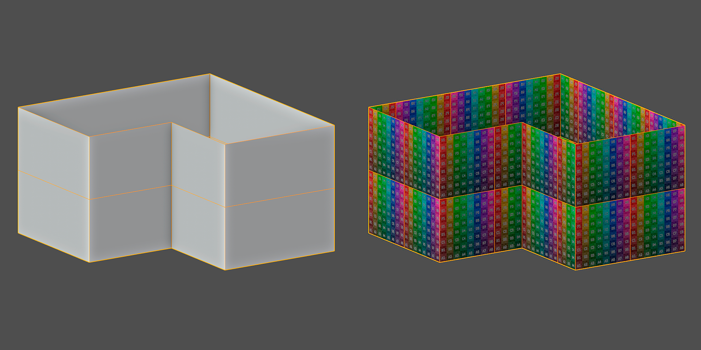
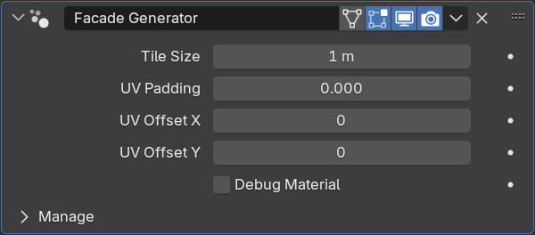

Facade Generator
================

Параметры
---------------

- Tile Size - размер тайла
- UV Padding - отступ от края UV
- UV Offset X - сдвиг UV для UDIM по оси X
- UV Offset Y - сдвиг UV для UDIM по оси Y

Ограничения
-------------

- Высота фасада должна быть равна ширине тайла, иначе UV выйдет за границу тайла
