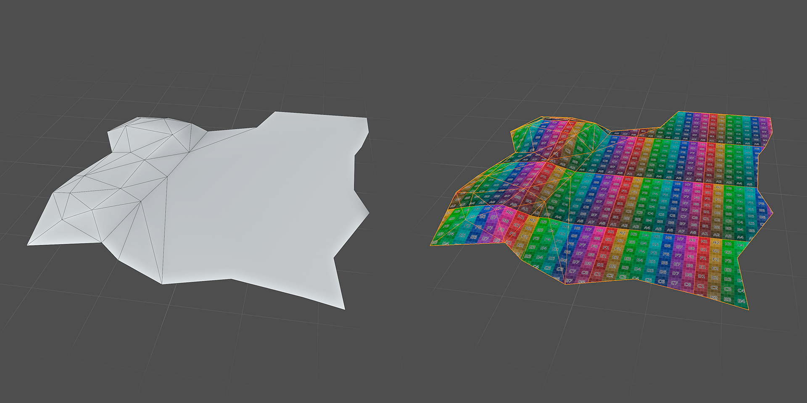
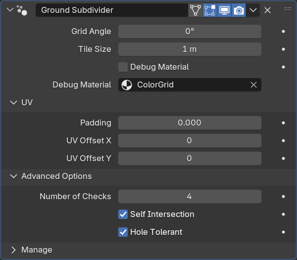

Ground Subdivider
===================

Подразделяет поверхность на квадраты с одинаковой UV развёрткой

.. warning:: 
    Перед использованием модификатора настоятельно рекоммендуется **сохранить проект**

Параметры
-------------

- Grid Angle - поворот UV по оси Z
- Tile Size - размер тайла

- Debug Material - включение дебаг материала
- Debug Material Slot - выбор дебаг материала

**UV** - развёртка

- Padding - отступы от края UV
- Offset - координаты UDIM

**Advanced Options**

- Number of Checks - количество дополнительных проверок высоты

.. note:: 
    Если на краях поверхности есть острые углы, вершина угла может остаться на нулевой координате по оси Z. В таком случчае модификатор выдаст ошибку в уведомлениях. Для решения проблемы можно передвинуть проблемные вершины или же увеличить количество проверок **Number of Checks**

Настройки **Self Intersection** и **Hole Tolerant** относятся к булевой операции, которая вырезает нужную форму из плейна. При возникновении проблем можно попробовать поменять их состояние

Ограничения
---------------

.. caution:: 
    Для корректной интерполяции высоты обязательно **триангулируйте** неплоскую часть геометрии.

- Сетка с тайлами проецируется на поверхность сверху. При **больших наклонах** могут возникать заметные **растяжения текстуры**
- Сглаживание не сохраняется после применения модификатора

Советы
---------------

.. caution:: 
    Модификатор основан на булевой операции пересечения и может медлено работать на **больших масштабах** или **сложной геометрии**

- При работе со сложной геометрией рекоммендуется использовать модификатор **Weld** после **Ground Subdivider** для совмещения близко находящихся точек
- Для сглаживания после **Ground Subdivider** можно использовать модификатор **Smooth by Angle** (ПКМ по объекту -> Shade Auto Smooth)