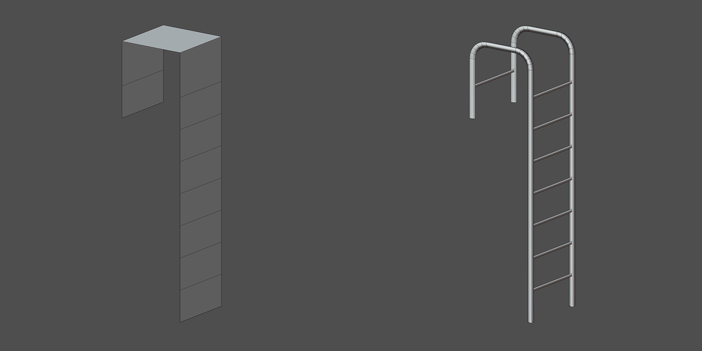
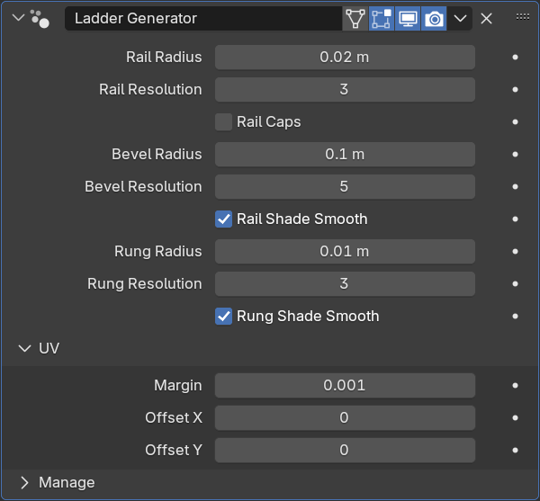

Ladder Generator
================

Создаёт лестницу из меша. Разрезы на плоскостях образуют ступеньки

Параметры
-------------

**Rail** - перила

- Rail Radius - радиус перил
- Rail Resolution - количество точек в сечении перил
- Rail Caps - заглушка на конце перила

- Bevel Radius - радиус скругления перил
- Bevel Resolution - количество сегментов для скругления перил

.. tip::
    Чтобы убрать Bevel, поставьте Bevel Resolution в значение 0

- Rail Shade Smooth - сглаживание перил

**Rung** - ступеньки

- Rung Radius - радиус ступенек
- Rung Resolution - количество точек в сечении ступеньки
- Rung Shade Smooth - сглаживание ступенек

**UV** - развёртка

- Margin - отступы между UV островами
- Offset - координаты UDIM

Ограничения
---------------

- Лестница должна быть симметричной
