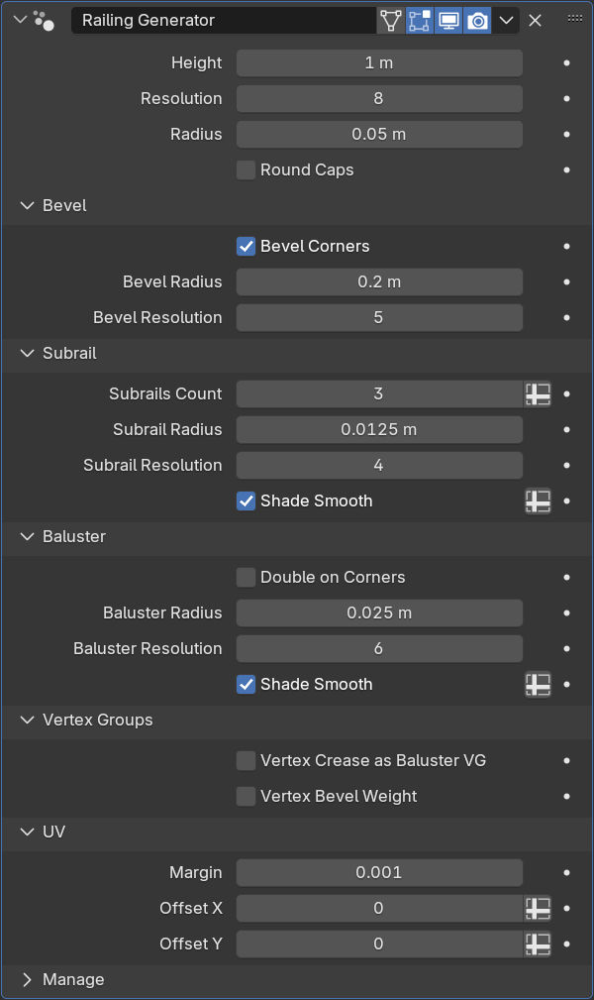

Railing Generator
=================

.. image:: images/railing_demo.png

Создаёт перила из рёбер мэша. Подразделением рёбер можно задавать расположение стоек у перил.

Параметры
---------------

* Height - высота ограждения
* Resoolution - количество полигонов в сечении поручня
* Radius - радиус поручня
* Round Caps - форма заглушки поручня

**Bevel**

* Bevel Corners - скругление углов поручней
* Bevel Radius - радиус скругления
* Bevel Resolution - количество подразделений при скруглении

**Subrail** - леер (ригель, трос)

* Subrails Count - количество лееров
* Subrail Radius - радиус лееров
* Subrail Resolution - количество полигонов в сечении леера
* Shade Smooth - сглаживание

**Baluster** - стойка

* Double on Corners - угловые стойки заменяются на парные (по краям скругления)
* Baluster Radius - радиус стойки
* Baluster Resolution - количество полигонов в сечении стойки
* Shade Smooth - сглаживание

**Vertex Groups**

.. caution:: 
    Не перепутайте Vertex Data с Edge Data

* Vertex Crease as Baluster VG - если Vertex Crease больше нуля, опора в данной точке будет удалена
* Vertex Bevel Weight - значение Vertex Bevel будет влиять на степень скругления поручня (Bevel Radius)

.. tip:: 
    При включении данной настройки может пропасть скругление, т.к. по умолчанию значения Bevel Weight равны нулю. При необходимости выделите все вершины и задайте значение Mean Bevel Weight равным 1, а затем приступайте к индивидуальным настройкам вершин.

**UV**

* Margin - отступы между UV островами
* Offset - сдвиг развёртки для UDIM

Советы
-------------

* Избегать острых углов