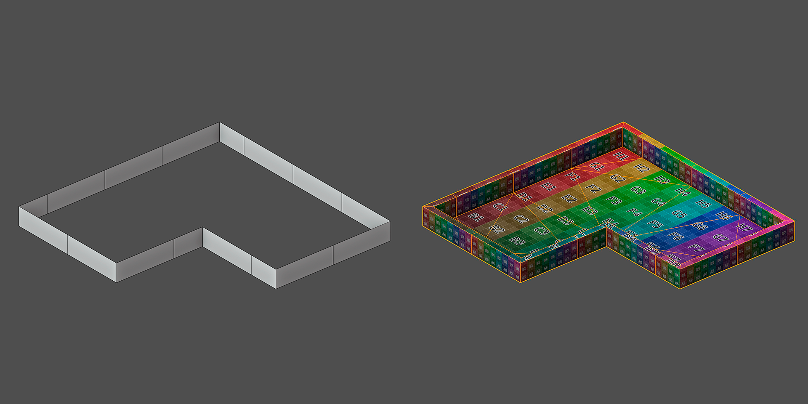
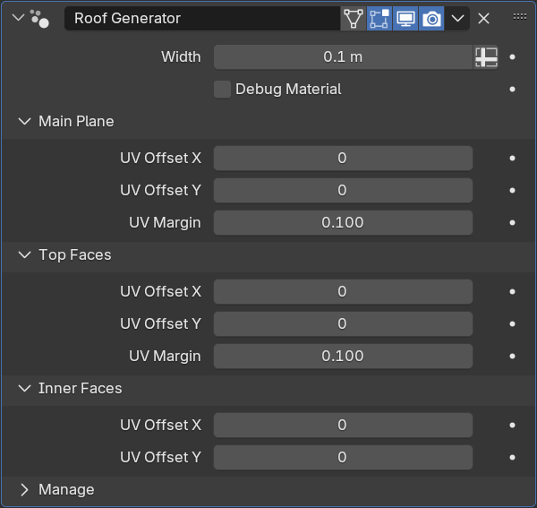

Roof Generator
================

Параметры
---------------

- Width - ширина ограждения
- UV Debug Material - включение дебаг материала для просмотра UV

.. caution::
     UV Debug Material нужно выключить перед применением модификатора, иначе материал останется на объекте

**Main Plain** - плоскость крыши
**Top Faces** - верхняя часть ограждений
**Inner Faces** - внутренняя часть ограждений

- UV Offset - координаты UDIM
- UV Margin - отступы между UV островами

Ограничения
-------------

- Крыша должна быть строго в плоскости XY
- Максимум один разрыв (простой формы)

Советы
-------------

* Для корректной развёртки внешней части (фасад) перед **Roof Generator** стоит использовать модификатор **Facade Generator**
* Избегать острых углов

.. caution:: 
    Бортик может быть выдавлен неправильно из-за автоматического подразделения модификатора **Facade Generator**

    .. image:: /images/roof_trouble_1.png
    
    Для решения проблемы нужно вручную добавить разрез на фасаде

    .. image:: /images/roof_trouble_2.png
