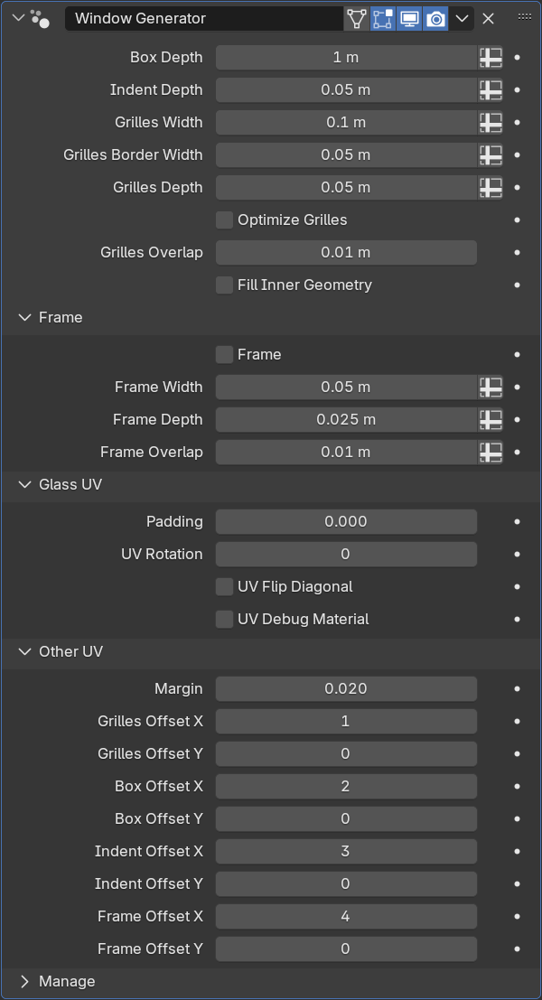

Window Generator
================

Создаёт окно из плоскости, в том числе угловые. В местах, где плоскость разделена лупкатом, будут созданы оконные перегородки

|window_demo|

.. |window_demo| raw:: html

    <iframe width="720" height="405" src="https://rutube.ru/play/embed/9d3791cc9abf971ba17e61e607732355" frameBorder="0" allow="clipboard-write; autoplay" webkitAllowFullScreen mozallowfullscreen allowFullScreen></iframe>

Части окна
-----------------

#. Glass - стекло
#. Grilles - рама
#. Box - короб (для создания эффекта параллакса)
#. Indent - заглубление от фасада (откос)
#. Frame - внешняя рама

Параметры
-----------------

- Box Depth - глубина короба
- Indent Depth - глубина отступа от фасада
- Grilles Width - ширина рамы внутри
- Grilles Border Width - ширина рамы у края
- Grilles Depth - глубина рамы

- Optimize Grilles - оптимизирует геометрию, убирая лишние вершины с граней плейна
- Grilles Overlap - пересечение Grilles и Indent. Работает только если опция Optimize Grilles выключена

.. note::
    При отключении Optimize Grilles количество точек на общем ребре Grilles и Indent не совпадает, из-за чего части окна соединяются не полностью. Чтобы избежать возможных артефактов затенения, края полигонов пересекаются на величину, указанную в Grilles Overlap

- Fill Inner Geometry - создание геометрии с обратной стороны окон

.. note:: 
    Настройка Fill Inner Geometry нужна для угловых окон, где можно увидеть обратную сторону окна. В других случаях настройку лучше отключать для оптимизации

    .. image:: images/window_fillinnergeometry.png

**Frame - внешняя рама**

- Frame Depth - глубина внешней рамы
- Frame Width - ширина внешней рамы
- Frame Overlap - заглубление краёв рамы в плоскость фасада

**Glass UV - развёртка стёкол**

* Padding - отступ от края юдима
* UV Rotation - поворот развёртки
* UV Flip Diagonal - смена x и y координат местами
* UV Debug Material - включение дебаг материала для просмотра UV

.. caution::
    UV Debug Material нужно выключить перед применением модификатора, иначе материал останется на объекте

**Other UV - развёртка остальных частей окна**

* Margin - отступы между UV островами
* Grilles Offset - координаты UDIM для частей окна

Ограничения
---------------------

- Поворот геометрии только по оси Z
- Разрезы должны быть параллельны краям плоскости
- В одном меше должно быть одно окно

.. caution::
    При создании нескольких обособленных плейнов внутри одного меша появится лишняя геометрия и будут проблемы с развёрткой

    .. image:: images/window_multiplewindows.png

Советы
-----------

На Т-образных узлах внутри остаётся лишняя геометрия. Бóльшая часть убирается модификатором Decimate в режиме Planar

